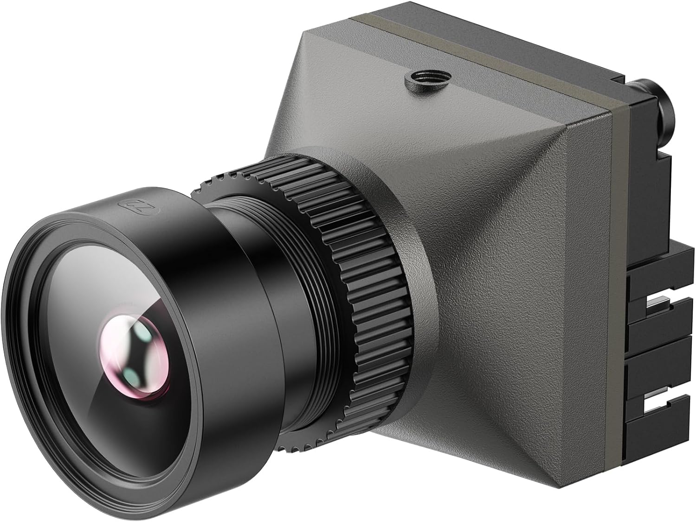
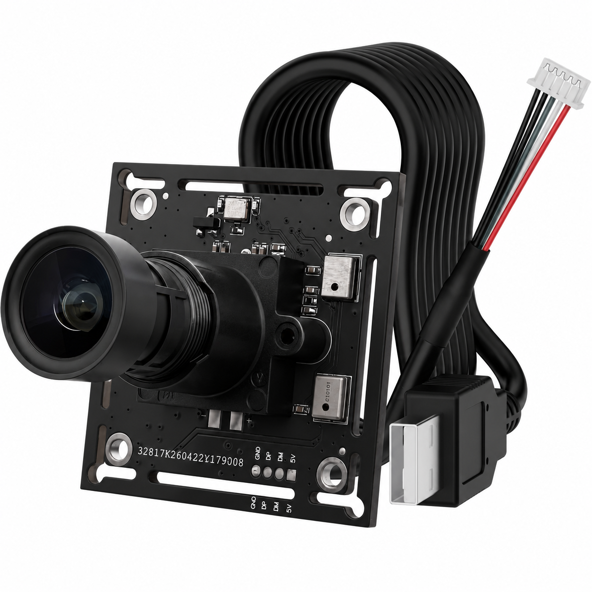

# Pibiger Cameras

This repository contains documentation and user manuals for all Pibiger camera products.

## Product List

| Model | Description | Manual | Image |
| :--- | :--- | :--- | :--- |
| FPV-001_M | FPV Camera — 1800TVl, 125° FOV, 5–40V, ≤30ms latency | [FPV_001_M.md](./FPV-001_M/FPV_001_M.md) |  |
| U20-GC2053-1080PW | USB 2.0 UVC Camera — GC2053 1/2.9" 2MP, 1080P/30fps MJPG, ~120° FOV, built-in microphone, 38×38mm, plug & play | [U20-GC2053-1080PW_EN.md](./U20-GC2053-1080PW/U20-GC2053-1080PW_EN.md) |  |
