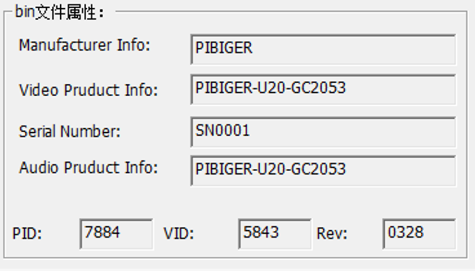
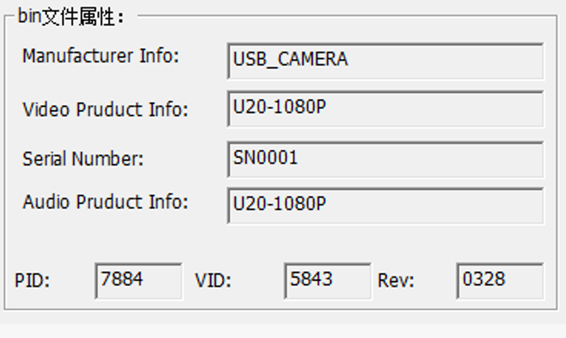

# USB Camera Manual

# 1. Product Description

**U20-GC2053-1080PW - Product Description**

---

## Product Overview

This professional-grade USB camera features a **2MP (1920x1080) CMOS (1/2.9") sensor** with **1/2.9" optical format** and **2.8um x 2.8um pixels**, delivering exceptional image quality with enhanced light sensitivity and superior signal-to-noise ratio.

Integrated **WDR supported (per GC2053 official datasheet)** technology balances exposure across high-contrast scenes, preserving details in both highlights and shadows.

Built on standard **USB Video Class (UVC)** protocol, the camera offers true plug-and-play compatibility with Windows, Linux, macOS, Android, Raspberry Pi, embedded systems. No proprietary drivers required.

**Lens:** YTOT YT10077-HD (Part No. 01.10077.001.02) | Mount: M12xP0.5 | Focal length: 3.18mm +/-5% | Aperture: F1.61 +/-10% (Fixed iris) | Focus: Manual | FOV on actual 1/2.9" sensor (6.17mm dia. image circle): D approx. 120.5deg (per lens spec viewpoint table; lens itself covers up to 1/2.7" = 134deg) | Image circle: 6.9mm dia. (MAX) | TTL: 22.12mm +/-0.2 (in air) | Optical BFL: 5.37mm +/-0.2 | Structure: 1G5P (first element plastic) | Optical distortion: -51% (@1/2.8") | Relative illumination: 44% (@1/2.8") | M.O.D: 1.8m | Barrel dia.: 14mm | RoHS

---

## Sensor Specifications

| Parameter | Specification |
|-----------|---------------|
| **Sensor Model** | GalaxyCore GC2053 |
| **Sensor Type** | CMOS (1/2.9") |
| **Optical Format** | 1/2.9" |
| **Active Pixels** | 1920 (H) x 1080 (V) |
| **Pixel Size** | 2.8um x 2.8um |
| **Max Frame Rate** | 30 fps @ 1920x1080 (MJPG) |
| **Output Interface** | USB 2.0 High-Speed (480Mbps) UVC (Plug & Play, driver-free) |
| **Video Format** | MJPG / YUYV |
| **Dynamic Range** | WDR supported (per GC2053 official datasheet) |
| **Low Light Performance** | TODO: no illuminance/SNR figure in datasheet |
| **Power Consumption** | Supplies AVDD 2.8V / DVDD 1.2V / IOVDD 1.8V (datasheet); module-level power not specified |

---

## Audio / Microphone

| Parameter | Specification |
|-----------|---------------|
| **Built-in Microphone** | Built-in microphone; same USB composite device as the camera (VID:PID 5843:7884) |
| **Audio Class** | USB Audio Class (UAC), driver-free |
| **Channels** | 1 (Mono) |
| **Sample Rate** | 44.1 kHz |
| **Bit Depth** | 24-bit (S24_3LE) |
| **Audio Format** | PCM, asynchronous capture endpoint (Async, EP 0x86) |

> Audio parameters measured from ALSA card 2 (PIBIGER-U20-GC2053, usb-xhci-hcd.1-2); capture on Linux via `arecord -D plughw:CARD=PIBIGERU20GC205,DEV=0 -f S24_3LE -r 44100 -c 1`

---

## Industry Applications

- **Machine Vision & Industrial Inspection**
- **Video Conferencing & Live Streaming**
- **Security & Surveillance**
- **Embedded / Raspberry Pi vision projects**

---

## Key Features (Amazon Bullet Points)

✅ **【1. Full HD 1080P, MJPG 1920x1080 @30fps, true plug-and-play】** Full HD 1080P, MJPG 1920x1080 @30fps, true plug-and-play

✅ **【2. Standard UVC driver-free protocol; compatible】** Standard UVC driver-free protocol; compatible with Windows / Linux / macOS / Android / Raspberry Pi

✅ **【3. Ultra-wide YTOT YT10077-HD M12 lens, approx. 120deg actual diagonal field of view】** Ultra-wide YTOT YT10077-HD M12 lens, approx. 120deg actual diagonal field of view

✅ **【4. GalaxyCore GC2053 1/2.9" 2MP CMOS image sensor】** GalaxyCore GC2053 1/2.9" 2MP CMOS image sensor with WDR support

✅ **【5. Built-in microphone (USB Audio Class, driver-free), mono 44.1kHz / 24-bit - capture audio and video together, no external mic required】** Built-in microphone (USB Audio Class, driver-free), mono 44.1kHz / 24-bit - capture audio and video together, no external mic required

✅ **【6. Compact 38x38mm PCB】** Compact 38x38mm PCB with swappable M12 lens for easy integration

✅ **【7. User-flashable firmware】** Customers can reflash firmware using the provided Windows flashing tool (`USBCamDownloadToolV3.6.exe`) — switch between PIBIGER-branded and generic white-label firmware at any time

✅ **【8. OEM / custom firmware】** Custom firmware with your own brand name, VID/PID, and product strings available — MOQ 1,000 pcs, contact sales@pibiger.com

## Hardware Specifications

| Parameter | Specification |
|-----------|---------------|
| **Dimensions** | PCB 38 x 38 mm + lens module (14mm dia. x ~22mm) |
| **Weight** | TODO: not provided in datasheet |
| **PCB Size** | 38 x 38 mm |
| **Mounting** | M12 lens holder; PCB corner mounting holes |


# 2. Measured Hardware Parameters (Linux live detection)

## Camera 1

### Basic Information

| Parameter | Value |
|------|------|
| **Product** | PIBIGER-U20-GC2053 |
| **Manufacturer** | PIBIGER |
| **VID** | `0x5843` |
| **PID** | `0x7884` |
| **Serial** | SN0001 |
| **Device Nodes** | /dev/video0, /dev/video1 |
| **Capture Node** | /dev/video0 |
| **USB Bus** | usb-xhci-hcd.1-2 |
| **USB Version/Speed** | USB 2.00  (USB 2.0 High-Speed (480Mbps)) |
| **Driver** | uvcvideo |

### Supported Formats & Resolutions

| Format | Resolution | Frame Rates (fps) |
|------|--------|------|
| **MJPG** (Motion-JPEG, compressed) | 1920x1080 | 30 |
|  | 1280x720 | 30 |
|  | 800x600 | 30 |
|  | 640x480 | 30 |
| **YUYV** (YUYV 4:2:2) | 1920x1080 | 5 |
|  | 1280x720 | 10 |
|  | 800x600 | 10 |
|  | 640x480 | 30 |
|  | 1920x1080 | 5 |
| **Max Resolution** | 1920x1080 | 30 |

### Control Parameters

| Control | Type | Range | Step | Default | Current | Note |
|---|---|---|---|---|---|---|
| brightness | int | 1 ~ 10 | 1 | 5 | 5 | — |
| contrast | int | 1 ~ 20 | 1 | 10 | 10 | — |
| saturation | int | 1 ~ 20 | 1 | 10 | 10 | — |
| white_balance_automatic | bool | — | — | 1 | 1 | — |
| gamma | int | 1 ~ 9 | 1 | 1 | 1 | — |
| gain | int | 0 ~ 255 | 1 | 0 | 0 | — |
| power_line_frequency | menu | 0 ~ 2 | — | 1 | 1 | {0=Disabled; 1=50 Hz; 2=60 Hz} |
| white_balance_temperature | int | 1 ~ 5 | 1 | 4 | 4 | inactive |
| sharpness | int | 0 ~ 255 | 1 | 0 | 0 | — |
| backlight_compensation | int | 0 ~ 64 | 1 | 0 | 0 | — |
| auto_exposure | menu | 0 ~ 3 | — | 0 | 0 | {1=Manual Mode} |
| exposure_time_absolute | int | 1 ~ 12287 | 1 | 78 | 78 | inactive |
| focus_absolute | int | 0 ~ 1023 | 1 | 512 | 0 | inactive |
| focus_automatic_continuous | bool | — | — | 1 | 1 | — |
---

## 3. Firmware

The U20-GC2053-1080PW ships with the **PIBIGER brand firmware** by default. Customers can switch to the generic (white-label) firmware at any time using the provided flashing tool.

### Firmware Variants

| Firmware File | Manufacturer Info | Video Product Info | Audio Product Info | PID | VID | Rev |
| :--- | :--- | :--- | :--- | :--- | :--- | :--- |
| [`PIBIGER-U20-GC2053_SN0001.bin`](./firmware/PIBIGER-U20-GC2053_SN0001.bin) | PIBIGER | PIBIGER-U20-GC2053 | PIBIGER-U20-GC2053 | 7884 | 5843 | 0328 |
| [`U20-1080P_SN001.bin`](./firmware/U20-1080P_SN001.bin) | USB_CAMERA | U20-1080P | U20-1080P | 7884 | 5843 | 0328 |

**PIBIGER brand firmware (`PIBIGER-U20-GC2053_SN0001.bin`):**



**Generic firmware (`U20-1080P_SN001.bin`):**



> **Default firmware**: `PIBIGER-U20-GC2053_SN0001.bin` (PIBIGER brand). The generic firmware (`U20-1080P_SN001.bin`) uses neutral branding and is suitable for resale or integration without Pibiger branding.

### Flashing Tool

Download [`USBCamDownloadToolV3.6.exe`](./firmware/USBCamDownloadToolV3.6.exe) (Windows), connect the camera via USB, open the tool, select the `.bin` file, and click **Download** to flash.

### OEM / Custom Firmware

Custom firmware with your own brand name, VID/PID, and product strings is available.

- **MOQ**: 1,000 pcs
- Contact: [sales@pibiger.com](mailto:sales@pibiger.com)

---

## 4. Python SDK (Cross-Platform)

A vendor-neutral Python toolkit is included for controlling and capturing from this camera on **Windows, Linux, and macOS**. All camera capabilities — formats, resolutions, frame rates, and image controls — are discovered at runtime with no hardwired model assumptions.

**Location:** [`python-code/`](./python-code/)

### Features

| Feature | Description |
| :--- | :--- |
| **Camera discovery** | Auto-detects all UVC cameras; excludes CSI/MIPI platform nodes |
| **Format enumeration** | Lists all supported formats (MJPG / YUYV), resolutions, and frame rates |
| **Best-mode selection** | Automatically picks the highest-resolution MJPG mode and top frame rate |
| **Exposure control** | Set manual exposure time (100 µs units on Linux/macOS; log₂-seconds on Windows) |
| **Gain control** | Read/write analogue gain |
| **Auto-exposure** | Enable/disable auto-exposure; adapts to the camera's actual menu entries |
| **Image controls** | Brightness, contrast, saturation, sharpness, white balance, backlight compensation |
| **Live preview** | OpenCV-based GUI preview on Linux; DirectShow on Windows; uvc-util on macOS |
| **Headless verification** | Measures real FPS and saves a snapshot — no display required |
| **Multi-camera support** | Select by device path (`/dev/videoN`) or name string |

### Platform Quick Start

**Linux:**
```bash
sudo apt install v4l-utils python3-opencv
python3 python-code/uvc_camera.py --list
python3 python-code/uvc_camera.py --info
python3 python-code/uvc_camera.py --verify --frames 90 --snapshot test
python3 python-code/linux/uvc_linux_control.py --status
python3 python-code/linux/uvc_linux_control.py --exposure-ms 5 --gain 16
python3 python-code/preview_linux.py
```

**Windows:**
```
python python-code\windows\uvc_windows_control.py --list
python python-code\windows\uvc_windows_control.py --status
python python-code\windows\uvc_windows_control.py --exposure-ms 10 --gain 32
python python-code\preview_windows.py
```

**macOS:**
```bash
brew install uvc-util python-tk
pip install opencv-python
python3 python-code/macos/uvc_exposure_macos.py --status
python3 python-code/macos/uvc_exposure_macos.py --exposure-ms 10
python3 python-code/preview_macos.py
```

### Exposure Unit Reference

| OS | Backend | Exposure Unit | Manual Switch |
| :--- | :--- | :--- | :--- |
| Linux | `v4l2-ctl` | `exposure_time_absolute`, 100 µs units | `auto_exposure=1` |
| macOS | `uvc-util` | `exposure-time-abs`, 100 µs units | `auto-exposure-mode=1` |
| Windows | OpenCV DirectShow | `CAP_PROP_EXPOSURE` = log₂(seconds) | `CAP_PROP_AUTO_EXPOSURE=0.25` |

> **Verified:** Linux toolkit tested against this camera (GC2053, `5843:7884`) — detected at `/dev/video0`, enumerated MJPG+YUYV at 1920×1080 / 1280×720 / 800×600 / 640×480, streamed at ~30 fps, manual exposure applied and read back correctly.

For per-platform details, see [`python-code/README.md`](./python-code/README.md) and the platform-specific READMEs under `python-code/linux/`, `python-code/windows/`, and `python-code/macos/`.
